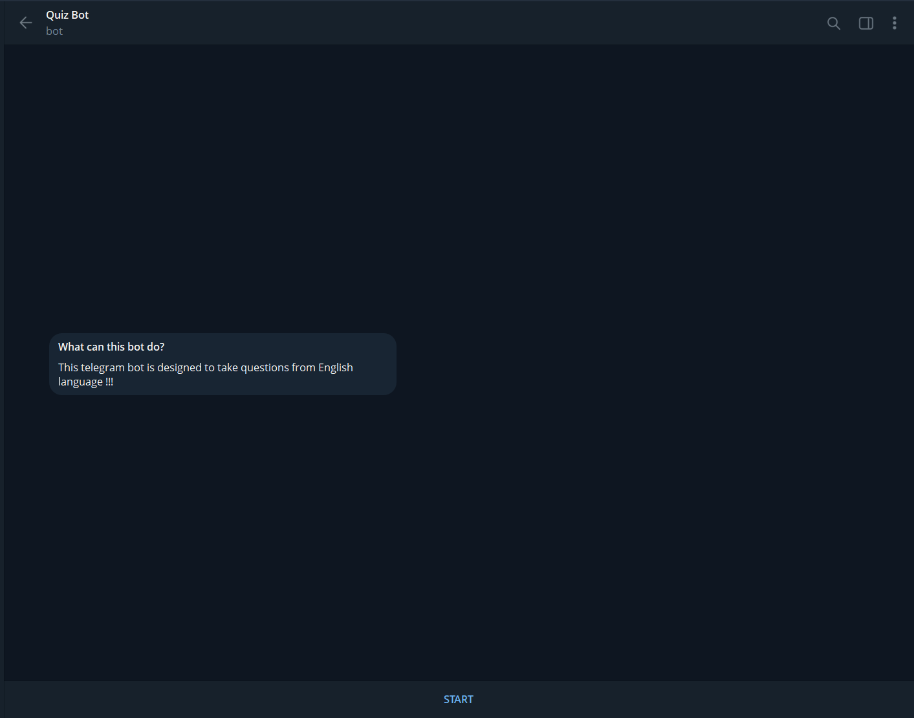
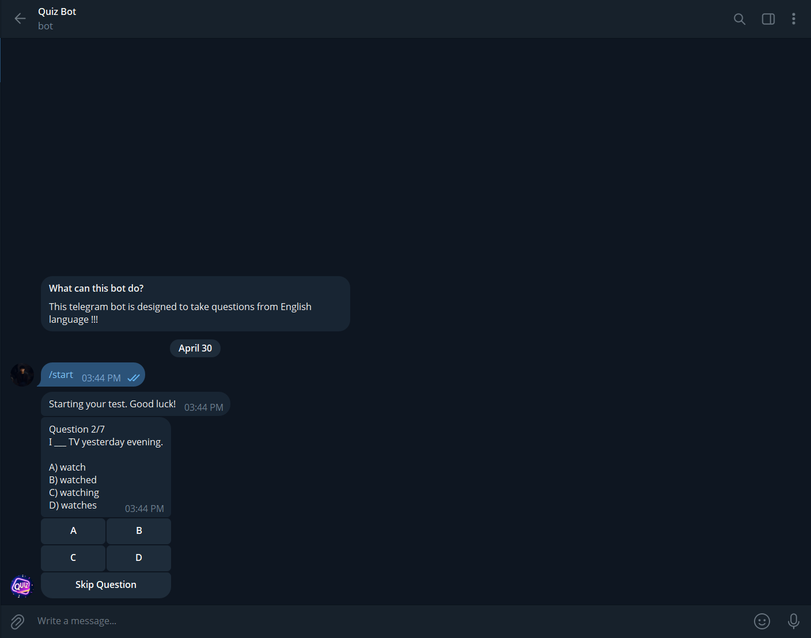

# English Quiz Bot

**Version:** `v0.1.0`  
**Status:** MVP / Local Telegram Bot  
**Built with:** Python + Telegram Bot API

Quiz Bot is a local Telegram English quiz bot designed for communication-focused English practice. It reads tests from JSON files, shows one question at a time, supports multiple question formats, tracks answers, allows limited skipping, saves results locally, and generates answer sheets after each test.

\---

## Screenshots

> Put these images in the project root, next to this README file.

<p align="center">
  
  <br>
  
</p>

\---

## Features

* Telegram bot built with Python
* JSON-based test system
* Fresh JSON loading when a new quiz starts
* Single-choice questions
* Multiple-choice questions
* Typed text-answer questions
* Skip system for choice questions
* Text questions cannot be skipped
* One-question-at-a-time quiz flow
* Automatic score calculation
* Mistake review after quiz completion
* Local result saving
* JSON answer sheet generation
* TXT answer sheet generation
* Simple modular project structure
* Beginner-friendly codebase

\---

## Question Types

Smith supports three question types.

### 1\. Single Choice

The learner chooses one correct answer.

```json
{
  "id": 1,
  "type": "single\_choice",
  "question": "She \_\_\_ to school every day.",
  "options": \["go", "goes", "going", "gone"],
  "correct\_answer": 1,
  "explanation": "Use 'goes' with she/he/it in Present Simple."
}
```

### 2\. Multiple Choice

The learner can choose more than one correct answer.

```json
{
  "id": 2,
  "type": "multiple\_choice",
  "question": "Which words are verbs?",
  "options": \["run", "beautiful", "eat", "blue"],
  "correct\_answers": \[0, 2],
  "explanation": "'Run' and 'eat' are verbs."
}
```

### 3\. Text Input

The learner types the answer manually.

```json
{
  "id": 3,
  "type": "text\_input",
  "question": "Complete the sentence: I \_\_\_ from Uzbekistan.",
  "correct\_answers": \["am", "I'm"],
  "case\_sensitive": false,
  "explanation": "The correct answer is 'am' or 'I'm'."
}
```

\---

## Project Structure

```text
bot/
├── bot.py
├── config.py
├── quiz\_engine.py
├── quiz\_loader.py
├── result\_manager.py
├── requirements.txt
├── .env.example
├── tests/
│   └── a2\_grammar\_01.json
└── results/
    ├── results.json
    └── answer\_sheets/
```

\---

## How It Works

1. User starts the bot with `/start`.
2. Bot shows a **Start Quiz** button.
3. Bot loads the JSON test file.
4. Bot creates a quiz session.
5. Bot shows one question at a time.
6. User answers by button or text.
7. Bot records the answer.
8. Bot moves to the next question.
9. At the end, bot calculates the result.
10. Bot creates JSON and TXT answer sheets.
11. Bot saves the result locally.

\---

## Setup

### 1\. Clone the repository

```bash
git clone https://github.com/YOUR\_USERNAME/smith-english-quiz-bot.git
cd smith-english-quiz-bot
```

### 2\. Create a virtual environment

```bash
python -m venv .venv
```

### 3\. Activate the virtual environment

Windows PowerShell:

```bash
.venv\\Scripts\\Activate.ps1
```

Windows CMD:

```bash
.venv\\Scripts\\activate.bat
```

Linux / macOS:

```bash
source .venv/bin/activate
```

### 4\. Install dependencies

```bash
pip install -r requirements.txt
```

### 5\. Create your `.env` file

Copy `.env.example` to `.env`.

```bash
cp .env.example .env
```

On Windows, you can also manually duplicate `.env.example` and rename the copy to `.env`.

Then add your Telegram bot token:

```env
BOT\_TOKEN=your\_telegram\_bot\_token\_here
```

### 6\. Run the bot

```bash
python bot.py
```

\---

## Creating a Telegram Bot Token

1. Open Telegram.
2. Search for `@BotFather`.
3. Send `/newbot`.
4. Choose a bot name.
5. Choose a bot username.
6. Copy the token.
7. Paste it into your `.env` file.

Never upload your `.env` file to GitHub.

\---

## Test JSON Format

All tests should follow this structure:

```json
{
  "test\_name": "A2 Grammar Test 01",
  "level": "A2",
  "version": "2026-04-30-v1",
  "questions": \[]
}
```

Rules:

* `test\_name` is required.
* `level` is required.
* `version` is recommended.
* `questions` must be a non-empty list.
* Each question must include an explanation.
* Choice question indexes start from `0`.

\---

## Skip System

Smith allows limited skipping for choice questions.

Skip works for:

* `single\_choice`
* `multiple\_choice`

Skip does not work for:

* `text\_input`

Skip limit formula:

```python
allowed\_skips = max(1, total\_questions // 10)
```

Examples:

|Total Questions|Allowed Skips|
|-:|-:|
|5|1|
|10|1|
|20|2|
|30|3|

\---

## Results and Answer Sheets

Smith saves quiz results locally.

Result summary:

```text
results/results.json
```

Answer sheets:

```text
results/answer\_sheets/
```

Each finished quiz can generate:

* JSON answer sheet
* TXT answer sheet

These files may contain learner data, so they should not be uploaded to GitHub.

\---

## GitHub Safety Checklist

Before pushing to GitHub, make sure you do **not** upload:

* `.env`
* virtual environment folders
* private learner results
* private answer sheets
* cache files

Safe to upload:

* source code
* `.env.example`
* `requirements.txt`
* sample tests
* README
* screenshots

\---

## Quick Test Checklist

* `/start` works
* Start Quiz button works
* Single-choice answer works
* Multiple-choice toggle works
* Multiple-choice submit works
* Empty multiple-choice submit is blocked
* Text input answer works
* Skip works for choice questions
* Skip does not appear for text questions
* Skip limit works
* Old buttons do not crash the bot
* Final result appears
* `results/results.json` is created
* JSON answer sheet is created
* TXT answer sheet is created

\---

## Roadmap

Possible future upgrades:

* Test selection menu
* Level selection: A1 / A2 / B1
* Topic selection
* Mistake review mode
* Daily quiz mode
* Admin upload mode
* SQLite database
* Better progress history
* More communication-focused test packs

\---

## Author

Created by **Kholbutayev-Tech**.

Quiz is a small but meaningful English learning project built with Python, Telegram, and JSON-based test logic.

